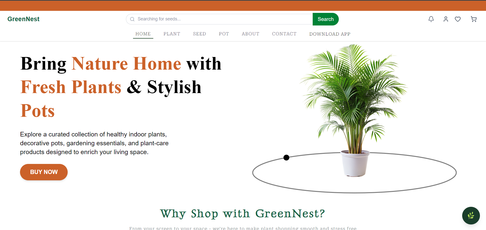
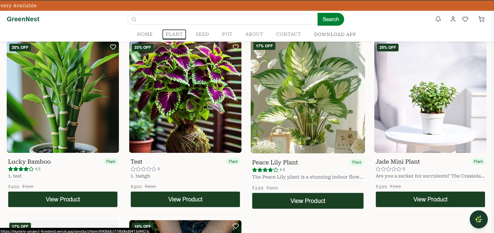
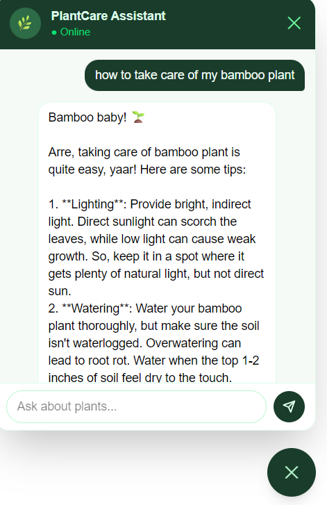
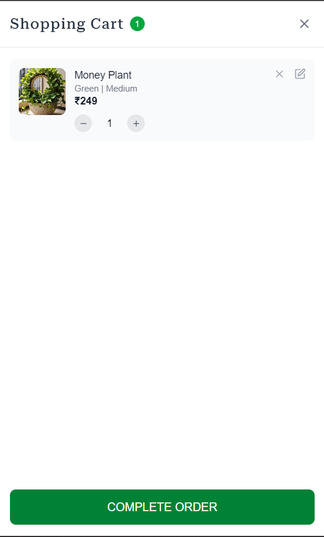
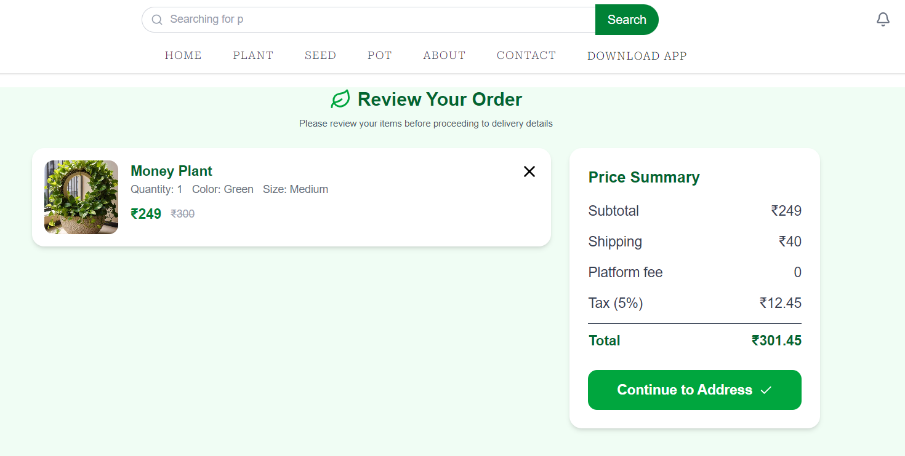

# 🌿 AI-Powered Plant Nursery Platform (Frontend)

A modern **full-stack MERN e-commerce platform** designed for buying plants with an intelligent AI assistant for plant care and recommendations.

🔗 Live Demo: https://nursery-project-frontend.vercel.app  

---

## 🚀 Features

### 🪴 User Features
- Browse plants with categories & filters
- View detailed plant information
- Add to cart & wishlist
- Place and track orders
- AI chatbot for plant care guidance 🌿

### 🤖 AI Assistant
- Suggests plants based on user needs
- Answers plant care queries
- Provides real-time assistance using LLaMA 3.1 (via Groq API)

### ⚡ Frontend Highlights
- Skeleton loaders for smooth UX
- Axios interceptors for API handling
- Responsive UI using Tailwind CSS
- Optimized state management

### ⚡ Real-Time Features
- WebSocket integration for live updates

---

## 📁 Folder Structure

src/
 ┣ components/
 ┣ Context_Api/
 ┣ helper/
 ┣ pages/
 ┣ hooks/
 ┣ network/ ## for interceptor
 ┣ utils/
 ┣ services/ (API calls)
 ┗ App.jsx

## 🛠️ Tech Stack

- React (Vite)
- Tailwind CSS
- Axios
- WebSockets
- Cloudinary (media handling)

---

## 📸 Screenshots

<!-- Add your screenshots here -->






---

## ⚙️ Setup Instructions

```bash
# Clone repo
git clone https://github.com/sahil04sharma/NurseryProject_Frontend.git

# Install dependencies
npm install

# Run project
npm run dev